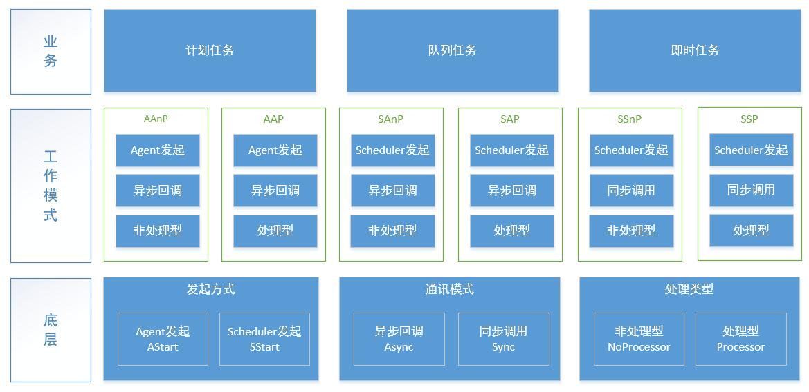
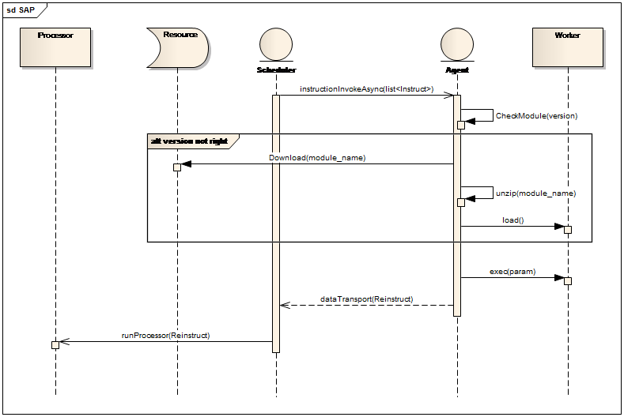

# 1	概述 #
一套跨平台远程管理框架，支持用户根据自身的业务进行多语言应用开发

# 2	实现目标和意义 #
1. 作为系统部对机器进行远程管理的中间件
1. 实现运维人员可以在从单点触发管理目前线上的机器（Windows/Linux）
1. 使开发人员可以方便的接入远程管理系统，并通过远程管理接口操作线上机器，实现运维自动化
1. 实现机器的定时任务集中管理

**1	通讯协议、在线检测与配置文件**
通讯协议基于Thrift，并且Scheduler与Agent全部注册到Zookeeper上，确保客户端的时效性，并且存储部分配置文件信息

**2	管理界面与外部接口**
提供一套统一的接口，允许系统调用接口实现远程内部所有功能。并且基于统一接口为用户提供一套管理界面，允许用户在管理界面上进行功能使用。

**3	操作模式**
所有用户/系统操作均由Scheduler端进行中转，并且中心端记录所有详细的操作日志

**4	应用与语言**
支持业务应用的开发，并且支持多语言支持(Python,Java,C#)，应用支持动态加载，可以在不重启Scheduler与Agent时执行相应业务应用

# 3	架构与组件 #

### 3.1	组件与部署结构 ###

**Elves-Scheduler**
Elves中心调度器,整套系统的核心，连接Apps与Agents的媒介，通过数据库获取异步任务或通过接口获取同步任务，进行任务中转与分发工作。

**Elves-Agent**
Elves任务代理器，部署在每台被控机上，主要接受来自Scheduler的指令，下载并加载相应的App-Worker，执行后将相应的执行结果发送至Scheduler端，Agent以Deamon形式运行，同时提供本身的定时自调用。

**App**
Elves业务应用，Elves系统本身不提供任何业务功能，仅作为任务转发的媒介，App为加载到Elves上的业务应用，每个App对应一个或多个指令，Elves支持不限量的Apps业务，所以如果业务需要，只需要单独开发App并加载到Elves即可。

App结构图

>逻辑组件:Worker : 在Agent端执行的业务逻辑组件，此组件自动加载到Agent端，并在被控机器上执行相应业务逻辑

>逻辑组件:Processor : 在App端执行的业务处理逻辑组件，此组件接收来自Agent端(Worker)执行后返回的结果，并作后续处理

**开放平台:OpenAPI**
Elves开放平台，提供RESTful形式的API供第三方系统开发调用，并同时提供OpenApi的后台管理功能

# 4	概念与分层 #

## 4.1	通讯模式 ##
*指令的工作模式*

**异步回调(Async)**
Agent在收到指令后异步执行相应的指令内容，执行结束后通过回调方式将内容反馈至Scheduler,Agent需主动连接Scheduler

**同步调用(Sync)**
Agent在收到指令后同步执行相应的指令内容，执行结束后将直接反馈内容至Scheduler,Agent无需主动连接Scheduler

## 4.2 发起方式 ##
*指令的发起方式*

**Agent发起(Agent)**
由Agent端自发的在本地进行任务的发起

**Scheduler发起(Scheduler)**
由Scheduler端发起任务触发Agent执行任务

## 4.2	处理类型 ##
*指令的一次完整生命周期的类型*

**非处理型(NoProcessor)**
该指令在Agent上运行后执行结束

**处理型(Processor)**
该指令在Agent上运行后将执行数据通过Scheduer回调至App后执行结束

## 4.3 工作模式 ##

>**AAnP** | 工作模式：异步模式 | 发起方式：Agent发起 | 生命类型：非处理型

>**AAP** | 工作模式：异步模式  | 发起方式：Agent发起 | 生命类型：处理型

>**SAnP** | 工作模式：异步模式  | 发起方式：Scheduler发起 |  生命类型：非处理型

>**SAP** | 工作模式：异步模式 |  发起方式：Scheduler发起 |  生命类型：处理型

>**SSnP** | 工作模式:同步模式  |  发起方式:Scheduler发起   |  生命类型:非处理型

>**SSP** | 工作模式:同步模式  |  发起方式:Scheduler发起   |  生命类型:处理型

## 4.3	任务 ##

*目前Elves支持以下3种任务*

**计划任务(Cron)**
根据规则周期性的执行某项任务

>支持模式：AAnP，AAP，SAnP，SAP

基础自主计划任务通过Agent存储于本地文件系统中的任务执行规则 或 通过Scheduler的任务执行规则由Scheduler进行任务指令的发送，由Agent自发的在本地进行任务的运行后结束 或 由Agent自发的在本地进行任务的运行后通过Scheduler回调至App-Processor后结束

**队列任务(Queue)**
异步并发方式地执行用户提交的某项任务
	
>支持模式：SAnP，SAP

中心计划任务通过Scheduler的任务执行规则由Scheduler进行任务指令的发送，Agent在接收到指令后进行任务的运行后结束 或 Agent在接收到指令后进行任务的运行后通过Scheduler回调至App-Processor后结束

注意：队列任务可以设置依赖关系，但当且仅当使用SAP模式才可使用其依赖功能

**即时任务(RT)**
即时阻塞方式执行用户提交的某项任务

>支持模式：SSP

及时任务为用户/第三方系统触发，并以同步调用方式在被控机上执行相应任务，实时获取相应执行结果后结束

# 5	系统设计 #

## 5.1	通讯结构体  ##

	//命令构体
	struct Instruct{
	    1 : string id,	//指令ID
	    2 : string ip,	//AgentIP
	    3 : string type, //类型(queue/cron.rt)
	    4 : string mode, //模式(sap,sanp,aap,aanp,ssp,ssnp)
	    5 : string app,	 //Elves App
	    6 : string func, //Elves App 方法
	    7 : string param, //参数JSON
	    8 : i32 timeout,  //超时时间
	    9 : string proxy  //代理器
	}
	
	//命令结果结构体
	struct Reinstruct{
	    1 : Instruct ins,
    	3 : i32 flag,
    	4 : i32 costtime,
    	5 : string result
	}

## 5.2	代码结构 ##

    .
	├─3rd-lib			#elves依赖的第三方包/类库
	├─designer			#elves设计相关附件
    ├─elves				#elves主代码,scheduler代码
    ├─elves-agent		#elves Agent组件
    ├─elves-openapi		#elves OpenApi站点
    └─elves-appsdk		#elves appSDK组件

## 5.3 ZooKeeper ##

    /								Zookeeper根节点
    └─Elves							Manager根节点(可自定义名称)
      └─Scheduler							scheduler根节点，存储记录scheduler自增ID号
          └─IP							Scheduler的IP信息，存储记录此scheduler是否正常
      └─Agent								Agent根节点
          └─IP							Agent的IP，存储记录该Agent的计划任务与已加载App
      └─App							App根节点
          └─GYMonitor						App的名称,内容存储版本号
			└─IP								数据存储，当前App的端口号

**全局配置文件存储与Elves根节点**

	{"SchedulerPort": "11000","Timeout": "80000","AgentPort": "11101","HttpRes": "http://192.168.6.116", "HttpResUSer": "admin", "HttpResPass": "1q2w3e4r"}

1. SchedulerPort ： Scheduler与Agent/App的交互端口，默认用户接口端口在此基础上加1
1. Timeout ： Scheduler与Agent/App的交互时的超时时间，只针对异步模式
1. AgentPort ： Agent对外提供服务的端口号
1. HttpRes ： HTTP资源下载地址，用户Agent端更新，Worker组件下载
1. HttpResUSer ： HTTP资源下载的账号
1. HttpResPass : HTTP资源下载的密码

## 5.4	核心库物理模型 ##

## 5.5	组件设计 ##
### 5.5.1 调度器-scheduler ###
**详见：** [elves-scheduler 详细设计](elves)

### 5.5.2 代理器-Agent ###
**详见：** [elves-agent 详细设计](elves-agent)

### 5.5.3 应用-App ###
**详见：** [elves-app 详细设计](elves-appsdk)

### 5.5.4 开放平台-OpenAPI ###
**详见：** [elves-openapi 详细设计](elves-openapi)

# 6 高级功能 #

高级功能为Elves内置的Base App提供的功能

## 6.1 定时器Cron ##

定时器功能支持Scheduler端发起或Agent端发起

规则说明

 	序号	说明	 是否必填	 允许填写的值	允许的通配符
 	1	 秒	 是	 0-59 	  , - * /
 	2	 分	 是	 0-59	  , - * /
 	3	小时	 是	 0-23	  , - * /
 	4	 日	 是	 1-31	  , - * ? / L W
 	5	 月	 是	 1-12 or JAN-DEC	  , - * /
 	6	 周	 是	 1-7 or SUN-SAT	  , - * ? / L #
 	7	 年	 否	 empty 或 1970-2099	 , - * /

**通配符说明:**

\* 表示所有值. 例如:在分的字段上设置 "*",表示每一分钟都会触发。

? 表示不指定值。使用的场景为不需要关心当前设置这个字段的值。例如:要在每月的10号触发一个操作，但不关心是周几，所以需要周位置的那个字段设置 为"?" 具体设置为 0 0 0 10 * ?

\- 表示区间。例如 在小时上设置 "10-12",表示 10,11,12点都会触发。
 
, 表示指定多个值，例如在周字段上设置 "MON,WED,FRI" 表示周一，周三和周五触发

/ 用于递增触发。如在秒上面设置"5/15" 表示从5秒开始，每增15秒触发(5,20,35,50)。 在月字段上设置'1/3'所示每月1号开始，每隔三天触发一次。

L 表示最后的意思。在日字段设置上，表示当月的最后一天(依据当前月份，如果是二月还会依据是否是润年[leap]), 在周字段上表示星期六，相当于"7"或"SAT"。如果在"L"前加上数字，则表示该数据的最后一个。例如在周字段上设置"6L"这样的格式,则表示“本 月最后一个星期五"

W 表示离指定日期的最近那个工作日(周一至周五). 例如在日字段上设置"15W"，表示离每月15号最近的那个工作日触发。如果15号正好是周六，则找最近的周五(14号)触发, 如果15号是周未，则找最近的下周一(16号)触发.如果15号正好在工作日(周一至周五)，则就在该天触发。如果指定格式为 "1W",它则表示每月1号往后最近的工作日触发。如果1号正是周六，则将在3号下周一触发。(注，"W"前只能设置具体的数字,不允许区间"-").

**Agent Func : Cron**

用于编辑Agent端发起的Cron任务

Param

	method	 : add/del
	id       : xxxxxxx
	app      : os_uniform
	func     : check_pc
    param    : {"aaa":"ccc"}
    rule     : * * * * * *

字段解释

	method 操作方法	add:新增,del:删除
	id     计划任务ID
	app    应用
	func   方法
	param  参数
	rule   规则

## 6.2 自更新AgentUpdate ##

**Func : AgentUpdate**

用于发起Agent更新任务

Param

	Version 		: v1.0.0
	ResourceUrl     : http://elves.gyyx.cn/csharpv1.0.0.zip
	
字段解释

	Version         Agent要更新的版本
	ResourceUrl		Agent的更新文件地址

# 7 更新记录 #
1. 20160519 更新代码结构将最外层的quartz-spring_demo移动至3rd-lib下
2. 20160519 更新业务执行逻辑时序图，[5.1.2]，[5.1.3]，增加[5.1]章节程序架构
2. 20160523 更新接口权限设计[5.4.2.2],[5.4.2.4]，增加业务逻辑组件章节[5.1.1.3.x]
3. 20160531 修订Scheduler的命名，修订[5.5.1	目录树]Module->ModuleName->IP节点的存储内容,新增[5.5.2 全局配置文件]
4. 20160606 新增OPENAPI章节与设计文档,拆分各组件README，重新定义任务类型
5. 20160607 更新概念与分层，定义模式/类型/任务
6. 20160612 更新分层概念，增加Module结构图，修订Instruct，支持一个模块多个指令，更新数据库结构，变更
7. 20160704 更新SDK，增加Processor可接收AgentIP