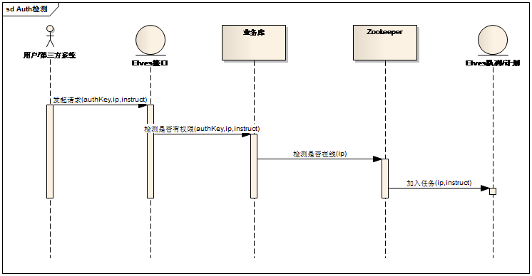

# Elves OpenAPI #
## 1.简介 ##
Elves OpenAPI 为用户提供WEB化的图形操作界面与为第三方系统提供Elves执行管理等操作接口，包含三个可见子模块，1个不可见子模块

**可见模块**

1. 公示信息，展示目前Elves的Agent，Module信息，并提供Elves系统的运行状况
1. 管理员后台，用于管理员对被控机及模块进行授权管理操作
1. 官方管控平台，为业务人员提供的WEB化的机器集中管理工具

**不可见模块**

管控接口：提供RESTful与Thrift形式的接口，供第三方系统调用

## 2. 签名 ##
接口签名是对请求的所有参数进行一个摘要计算以防止伪造请求的方法，对于以下的请求：

    http://host:port/foo/bar/?key2=value2&key1=value1&timestamp=1234567890

经过签名计算后的请求如下：

    http://host:port/foo/bar/?key2=value2&key1=value1&auth_id=x&timestamp=1234567890&sign_type=MD5&sign=fb316e29172065a840090ddc759f4dff

签名的计算方法为：

**1. 生成待签名字符串**
将 Uri 的 Path 部分（在本例中为："/foo/bar/"），与接口指定的 Uri 参数对（通常为除 sign 和 sign_type 外的所有参数，则在本例中为"key2=value2", "key1=value1", "timestamp=1234567890"）经过字母顺序排序后以“&”连接的字符串通过“?”进行拼接进行拼接，生成最终带签名字符串，即本例中结果（signString）为：

      /foo/bar/?auth_id=x&key1=value1&key2=value2&timestamp=1234567890

**2. 对待签名字符串进行签名计算**
使用在 sign_type 中指定的签名算法计算后，赋值给 sign 参数。在进行签名计算时，应使用待签名字符串的UTF-8编码字节。

如：在使用 MD5 算法进行签名时，待签名字符串后应当拼接双方约定好的私钥，之后对拼接后的待签名字符串进行摘要计算（MD5(signString+key)），即本例中若密钥为“testkey”，待计算MD5的字符串为：

    /foo/bar/?auth_id=x&key1=value1&key2=value2&timestamp=1234567890testkey

将计算出来的签名 sign 及 sign_type 与原参数拼接后，最后生成的URI则将如文首所示；

**3. 其他注意事项**
对于在传递中进行了 url 编码的参数，在拼接待签名字符串时应使用的是未经编码的原值。
如果接口要求时间戳则应为 Unix 标准时间戳，且服务端应当对请求有效时间做出约定。

**4. 签名算法：**
1. MD5
在使用 MD5 进行签名时，待签名字符串后应当拼接双方约定好的私钥，之后对拼接后的待签名字符串进行摘要计算。

## 3. 接口 ##

#### 公共请求参数 ####
	auth_id      必填       int        Elves提供的AuthID	
	timestamp    必填       int        当前的时间戳
    sign_type    必填       string     签名类型(MD5/HASH1)
    sign         必填       string     签名值

### 3.1 获取模块列表
#### 3.1.1 URL ####
	GET	/modules

#### 3.1.2 请求参数 ####
	modules     选填     string     module列表
	count       选填     int        返回的记录条数，默认为50
	page        选填     int        返回结果的页码，默认为1

#### 3.1.3 返回结果 ####
	{
	    "modules": [
			{
			    "module": "win_os_uniform",
			    "module_name": "OS一致化检测",
			    "module_ver": "1.0.0"
			},
			...
	    ],
	    "now_page": 5,
	    "all_page": 18,
	    "total_number": 10
	}

#### 3.1.4 返回字段说明 ####
	module         string     模块
	module_name	   string     名称
	module_ver     string     版本

### 3.2 获取当前authKey可管理的Agent列表###
#### 3.2.1 URL ####
	GET /agents	

#### 3.2.2 请求参数 ####
	agent_ips 选填       string     AgentIp(示例: {["127.0.0.1"],["127.0.0.2"]} )，默认显示全部
	count     选填       int        返回的记录条数，默认为50
	page      选填       int        返回结果的页码，默认为1

#### 3.2.3 返回结果 ####
	{
	    "agents": [
			{ 
			    "agent_ip": "127.0.0.1",
			    "agent_name": "测试机",
			    "online_status": true,
			    "agent_type": "cSharpAgent",
			    "agent_ver": "1.0.0",
			    "start_time": "2016/6/26 03:06:20",
				"avl_module": [
			        "os_unionform",
			        "time_check",
					...
			    ]
			},
			...
	    ],
	    "now_page": 5,
	    "all_page": 18,
	    "total_number": 2100
	}

#### 3.2.4 返回字段说明 ####
	agent_ip            string           AgentIP地址
	agent_name          string           Agent名称
	online_status       bool             Agent是否在线,true:是，false:否
	agent_type          string           Agent的类型           
	agent_ver           string           Agent的版本
	start_time          datetime         Agent启动时间
	avl_module          object           AuthKey拥有的可执行模块
	

### 3.3 获取Agent的定时任务###
#### 3.3.1 URL ####
	GET /agents/crons

#### 3.3.2 请求参数 ####
	agent_ip      必填       string     AgentIp
	cron_type     必填       enum       定时类型(self:自主定时,center:中心定时)

#### 3.3.3 返回结果 ####
	{
		"agents_cron":[
			{
                "cron_id"   :"A49B1E8FA1B43BC5",
                "agent_ip"  : "127.0.0.1",
                "cron_type" : "self",
                "instruct"  : "win_os_uniform",
                "param"     : "",
                "rule"      : "0/10 * * * * ?",
                "create_time": "2016-06-06 17:28:08"
			},
			...
		]
	}

#### 3.3.4 返回字段说明 ####
	cron_id                   varchar(16)            定时任务ID
	agent_ip                  varchar(15)            AgentIP
	cron_type                 enum                   定时类型(self:自主定时,center:中心定时)
	instruct                  varchar(32)            指令
	param                     text                   参数
	instruct                  varchar(32)            指令
	rule                      varchar(155)           规则
    create_time               datetime               创建时间                      

### 3.4 获取Agent执行的队列任务日志 ###
#### 3.4.1 URL ####
	GET /logs/queues	

#### 3.4.2 请求参数 ####
	agent_ip           必填    string    AgentIP地址
	instruct           必填    string    指令
	createtime_begin   选填    datetime  任务创建的开始时间,默认为0000-00-00 00:00:00
	createtime_end     选填    datetime  任务创建的结束时间,默认为2116-01-01 00:00:00
	createtime_sort    选填    int       时间排序(asc:正序,desc:倒序),默认倒序
	result_flag        选填    int       任务状态（0:失败,1:成功,2:执行中)，支持组合如01,默认为全部012
	count              选填    int       返回的记录条数，默认为50
	page               选填    int       返回结果的页码，默认为1

#### 3.4.3 返回结果 ####

	{
	    "queue_exec_logs": [
			{
			    "log_id": "BF0EE718FCC41307",
			    "agent_ip": "192.168.6.119",
			    "instruct": "testmodule" ,
			    "param": "" ,
			    "starttime": "2016-06-03 17:55:19" ,
			    "agent_sync_flag": "1" ,
			    "agent_sync_error": "" ,
			    "agent_sync_costtime": "0" ,
			    "agent_callback_time": "2016-06-03 17:55:19" ,
			    "worker_message": "Demo TEST" ,
			    "module_sync_flag": "1" ,
			    "module_sync_error": "" ,
			    "module_sync_costtime": "0" ,
			    "module_callback_time": "2016-06-03 17:55:20" ,
			    "processor_message": "Demo TEST | Process Reviced!" ,
			    "processor_costtime": "1" ,
			    "endtime": "2016-06-03 17:55:20",
			    "result_flag": "1"
			},
			...
	    ],
	    "now_page": 5,
	    "all_page": 18,
	    "total_number": 2100
	}

#### 3.4.4 返回字段说明 ####
	log_id                    varchar(16)            消息ID
	agent_ip                  varchar(15)            AgentIP
	instruct                  varchar(32)            指令
	param                     text                   参数
	starttime                 datetime               开始时间
	agent_sync_flag           tinyint(1)             发送agent同步消息状态(1:成功,0:异常)
	agent_sync_error          varchar(255)           同步agent消息异常信息
	agent_sync_costtime       int(11)                发送agent同步消息耗时
	agent_callback_time       datetime               agent回调时间
	worker_message            text                   worker执行结果
	worker_costtime           int(11)                worker执行时间
	module_sync_flag          tinyint(1)             发送module同步消息状态(1:成功,0:异常)
	module_sync_error         varchar(255)           同步module消息异常信息
	module_sync_costtime      int(11)                发送module同步消息耗时
	module_callback_time      datetime               module回调时间
	processor_message         text                   processor执行结果
	processor_costtime        int(11)                processor执行时间
	endtime                   datetime               结束时间
	result_flag               tinyint(1)             整个异步执行结果(0:失败,1:成功,2:执行中)

### 3.5 获取Agent执行的远程定时任务日志 ###
#### 3.5.1 URL ####
	GET /logs/centercron

#### 3.5.2 请求参数 ####
	agent_ip           必填    string    AgentIP地址
	instruct           必填    string    指令
	createtime_begin   选填    datetime  任务创建的开始时间,默认为0000-00-00 00:00:00
	createtime_end     选填    datetime  任务创建的结束时间,默认为2116-01-01 00:00:00
	createtime_sort    选填    int       时间排序(asc:正序,desc:倒序),默认倒序
	result_flag        选填    int       任务状态（0:失败,1:成功,2:执行中)，支持组合如01,默认为全部012
	count              选填    int       返回的记录条数，默认为50
	page               选填    int       返回结果的页码，默认为1

#### 3.5.3 返回结果 ####
	{
	    "centercron_exec_logs": [
			{
			    "log_id": "BF0EE718FCC41307",
			    "agent_ip": "192.168.6.119",
			    "instruct": "testmodule" ,
			    "param": "" ,
			    "starttime": "2016-06-03 17:55:19" ,
			    "agent_sync_flag": "1" ,
			    "agent_sync_error": "" ,
			    "agent_sync_costtime": "0" ,
			    "agent_callback_time": "2016-06-03 17:55:19" ,
			    "worker_message": "Demo TEST" ,
			    "module_sync_flag": "1" ,
			    "module_sync_error": "" ,
			    "module_sync_costtime": "0" ,
			    "module_callback_time": "2016-06-03 17:55:20" ,
			    "processor_message": "Demo TEST | Process Reviced!" ,
			    "processor_costtime": "1" ,
			    "endtime": "2016-06-03 17:55:20" ,
			    "result_flag": "1"
			},
			...
	    ],
	    "now_page": 5,
	    "all_page": 18,
	    "total_number": 2100
	}

#### 3.5.4 返回字段说明 ####
	log_id                    varchar(19)            消息ID
	agent_ip                  varchar(15)            AgentIP
	instruct                  varchar(32)            指令
	param                     text                   参数
	starttime                 datetime               开始时间
	agent_sync_flag           tinyint(1)             发送agent同步消息状态(1:成功,0:异常)
	agent_sync_error          varchar(255)           同步agent消息异常信息
	agent_sync_costtime       int(11)                发送agent同步消息耗时
	agent_callback_time       datetime               agent回调时间
	worker_message            text                   worker执行结果
	worker_costtime           int(11)                worker执行时间
	module_sync_flag          tinyint(1)             发送module同步消息状态(1:成功,0:异常)
	module_sync_error         varchar(255)           同步module消息异常信息
	module_sync_costtime      int(11)                发送module同步消息耗时
	module_callback_time      datetime               module回调时间
	processor_message         text                   processor执行结果
	processor_costtime        int(11)                processor执行时间
	endtime                   datetime               结束时间
	result_flag               tinyint(1)             整个异步执行结果(0:失败,1:成功,2:执行中)

### 3.6 获取Agent执行的本地定时任务日志 ###
#### 3.6.1 URL ####
	GET /logs/selfcron

#### 3.6.2 请求参数 ####
	agent_ip           必填    string    AgentIP地址
	instruct           必填    string    指令
	createtime_begin   选填    datetime  任务创建的开始时间,默认为0000-00-00 00:00:00
	createtime_end     选填    datetime  任务创建的结束时间,默认为2116-01-01 00:00:00
	createtime_sort    选填    int       时间排序(asc:正序,desc:倒序),默认倒序
	result_flag        选填    int       任务状态（0:失败,1:成功,2:执行中)，支持组合如01,默认为全部012
	count              选填    int       返回的记录条数，默认为50
	page               选填    int       返回结果的页码，默认为1

#### 3.6.3 返回结果 ####

	{
	    "selfcron_exec_logs": [
			{
			    "log_id": "BF0EE718FCC41307",
			    "agent_ip": "192.168.6.119",
			    "instruct": "testmodule" ,
			    "param": "" ,
			    "agent_callback_time": "2016-06-03 17:55:19" ,
			    "worker_message": "Demo TEST" ,
			    "module_sync_flag": "1" ,
			    "module_sync_error": "" ,
			    "module_sync_costtime": "0" ,
			    "module_callback_time": "2016-06-03 17:55:20" ,
			    "processor_message": "Demo TEST | Process Reviced!" ,
			    "processor_costtime": "1" ,
			    "endtime": "2016-06-03 17:55:20" ,
			    "result_flag": "1"
			},
			...
	    ],
	    "now_page": 5,
	    "all_page": 18,
	    "total_number": 2100
	}

#### 3.6.4 返回字段说明 ####
	log_id                    varchar(16)            消息ID
	agent_ip                  varchar(15)            AgentIP
	instruct                  varchar(32)            指令
	param                     text                   参数
	starttime                 datetime               开始时间
	worker_message            text                   worker执行结果
	worker_costtime           int(11)                worker执行时间
	module_sync_flag          tinyint(1)             发送module同步消息状态(1:成功,0:异常)
	module_sync_error         varchar(255)           同步module消息异常信息
	module_sync_costtime      int(11)                发送module同步消息耗时
	module_callback_time      datetime               module回调时间
	processor_message         text                   processor执行结果
	processor_costtime        int(11)                processor执行时间
	endtime                   datetime               结束时间
	result_flag               tinyint(1)             整个异步执行结果(0:失败,1:成功,2:执行中)

### 3.7 创建队列任务 ###
#### 3.7.1 URL ####
	POST /queues/create

#### 3.7.2 请求参数 ####
	agent_ip           必填    string    AgentIP地址
	instruct           必填    string    指令
	json_param         选填    string    指令的参数JSON形式({"key1":"value1","key2":"value2"})
	depend_queue_id    选填    string    依赖队列任务的ID

#### 3.7.3 返回结果 ####
	{
		"queue_id" : "BF0EE718FCC41307",
		"flag" : true,
		"error" : ""
	}

#### 3.7.4 返回字段说明 ####
	tq_id                     varchar(16)           队列任务ID
	flag                      bool                  操作队列状态(true:成功,false:失败)
	error                     text                  操作失败时错误信息

### 3.8 提交队列任务 ###
#### 3.8.1 URL ####
	POST /queues/commit

#### 3.8.2 请求参数 ####
	agent_ip           必填    string    AgentIP地址
	json_queue_ids     必填    string    JSON形式的queue_id(["BF0EE718FCC41307","EC0EF718FCC41307"])

#### 3.8.3 返回结果 ####
	{
		[
			"queue_id" : "BF0EE718FCC41307",
			"flag" : true,
			"error" : ""
		],
		...
	}

#### 3.8.4 返回字段说明 ####
	tq_id                     varchar(16)            队列任务ID
	flag                      bool                   操作状态(true:成功,false:失败)
	error                     text                   操作失败的错误信息

### 3.9 停止队列任务 ###
#### 3.9.1 URL ####
	POST /queue/stop
#### 3.9.2 请求参数 ####
	agent_ip            必填    string    AgentIP地址
	json_queue_ids      必填    string    JSON形式的queue_id(["BF0EE718FCC41307","EC0EF718FCC41307"])

#### 3.9.3 返回结果 ####
	{
		[
			"queue_id" : "BF0EE718FCC41307",
			"flag" : true,
			"memo" : ""
		],
		...
	}

#### 3.9.4 返回字段说明 ####
	queue_id                  varchar(16)            队列任务ID
	flag                      int                    操作状态(true:成功,false:失败)
	error                     text                   操作失败的错误信息

### 3.10 创建计划任务 ###
#### 3.10.1 URL ####
	POST /cron/create

#### 3.10.2 请求参数 ####
	agent_ip        必填       string          AgentIP地址
	cron_type       必填       enum            Cron类型(center,self)
    instruct        必填       string          指令
    json_param      选填       string          指令的参数
    rule            必填       string          规则        
  
#### 3.10.3 返回结果 ####
	{
		"cron_id" : "BF0EE718FCC41307",
		"flag" : true,
		"memo" : ""
	}

#### 3.10.4 返回字段说明 ####
	cron_id                   varchar(16)            队列任务ID
	flag                      int                    操作状态(true:成功,false:失败)
	error                     text                   操作失败的错误信息

### 3.11 删除计划任务 ###
#### 3.11.1 URL ####
	POST /cron/delete

#### 3.11.2 请求参数 ####
	agent_ip         必填       string          AgentIP地址
	cron_id          必填       string          CronID       
  
#### 3.11.3 返回结果 ####
	{
		"cron_id" : "BF0EE718FCC41307",
		"flag" : true,
		"memo" : ""
	}

#### 3.11.4 返回字段说明 ####
	cron_id                   varchar(16)            队列任务ID
	flag                      int                    操作状态(true:成功,false:失败)
	error                     text                   操作失败的错误信息

### 3.12 执行及时任务 ###
#### 3.12.1 URL ####
	POST /rltime/exec

#### 3.12.2 请求参数
	agent_ip        必填       string          AgentIP
    instruct        必填       string          指令
    json_param      选填       string          指令的参数
    timeout         选填       int             执行超时时间，默认为90秒

#### 3.12.3 返回结果 ####
	{
	    "log_id": "BF0EE718FCC41307",
	    "agent_ip": "192.168.6.119",
	    "instruct": "testmodule" ,
	    "param": "" ,
	    "create_time": "2016-06-03 17:55:19" ,
		"agent_sync_flag": "1" ,
		"agent_sync_error": "" ,
	    "worker_message": "Demo TEST" ,
	    "worker_costtime": "5"
	}

#### 3.12.4 返回字段说明 ####
	log_id                    varchar(16)            及时任务ID
	agent_ip                  int                    AgentIP地址
	instruct                  varchar(32)            指令
	param                     text                   参数
	starttime                 datetime               开始时间
	agent_sync_flag           tinyint(1)             发送agent同步消息状态(1:成功,0:异常)
	module_sync_error         varchar(255)           同步agent消息异常信息
	worker_message            text                   worker执行结果
	worker_costtime           int(11)                worker执行时间

#### 4.接口设计说明 ####
Elves权限管理机制全部设计于对外接口上，所有的任务发起，请求均通过Elves对外暴露接口实现并采用authKey形式进行，每个Key对应一批Agent与在此Agent上可以执行的指令，接口的执行时序如下：

