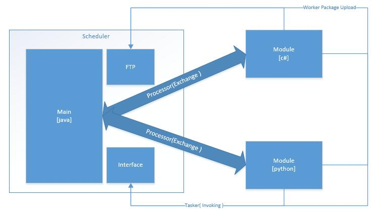

### scheduler ###
#### 1.简介 ####

 
#### 2.Thrift服务 ####

	//Scheduler面对Agent的接口
	service SchedulerService{
		//接口检测
		string aliveCheck()
		//异步返回结果处理器
		string dataTransport(1:Reinstruct reins)
		//指令中转器[同步]
		string instructionTransit(1:string ip, 2:Instruct ins)
	}

#### 3.重点文件结构 ####

	.
    └─elves
       └─src
          └─java
             ├─main
             │  └─cn
             │     └─gyyx
	         │        └─elves
             │           └─scheduler
             │              ├─dao
             │              │  └─impl
             │              ├─pojo
             │              ├─service
             │              │  └─impl
   	         │              └─util
             └─resources

权限数据库设计详见[Elves主设计](../)[5.6]章节

#### 5.设计思想 ####
1. Master注册到Zookeeper上，进行健康监测
1. 多个scheduler依靠Zookeeeper通过选举方式产生Leader，Leader负责计划任务的调用执行与队列任务的调用执行，所有的scheduler均会进行Agent的数据处理
1. 指令中转器可由用户通过WEB界面或其他系统调用，并且只可以采用同步模式，异步模式将采用队列方式提交
1. scheduler提供队列功能，并且队列之间可以设置依赖关系，在构造完队列后提交至scheduler，由scheduler触发完成后续操作，队列功能全部采用异步模式进行
1. scheduler提供计划任务功能，并且提供对外接口，可以设置某IP上的队列，支持设置由scheduler触发或Agent触发模式
1. scheduler与核心数据库进行数据交互
1. scheduler采用jdk1.7, Spring , Mybatis构建JAVA客户端项目